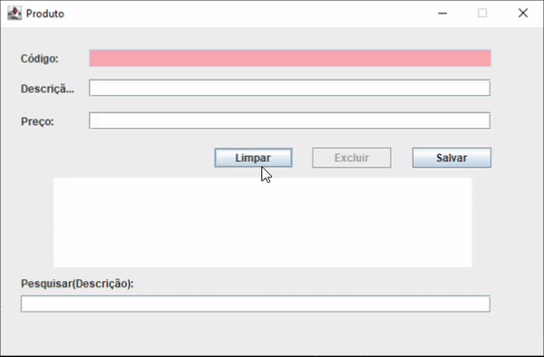
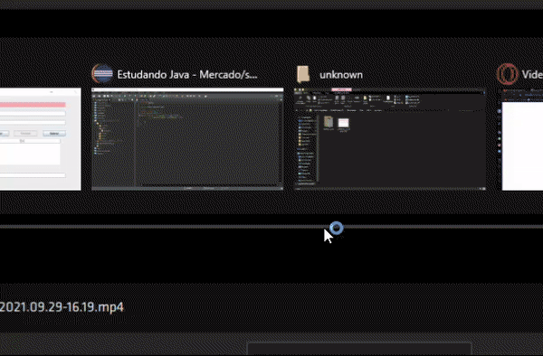
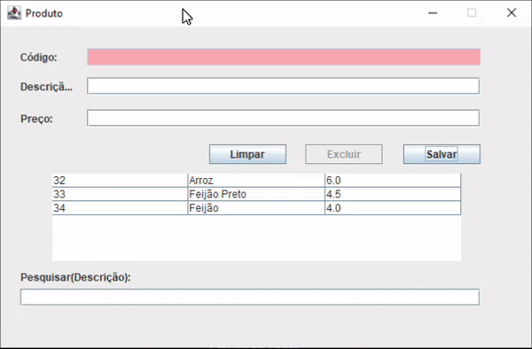

# Cadastro de Produtos
Esta aplicação tem objetivo de servir como portifólio pessoal!

Linkedln:www.linkedin.com/in/caio-cipriano
<h2>Sobre:</h2>

Sua finalidade é inserir, remover e atualizar as informações.

Inserindo na tabela:

 

Excluindo da tabela, Também implementado um botão "limpar" que tem a função de limpar os campos:

 

 
Atualiza a tabela, Caso tenha algum campo em branco ele emite uma pop-up e limpa os campos:

 

Barra de pesquisa para consutar pelo nome do produto:

 

